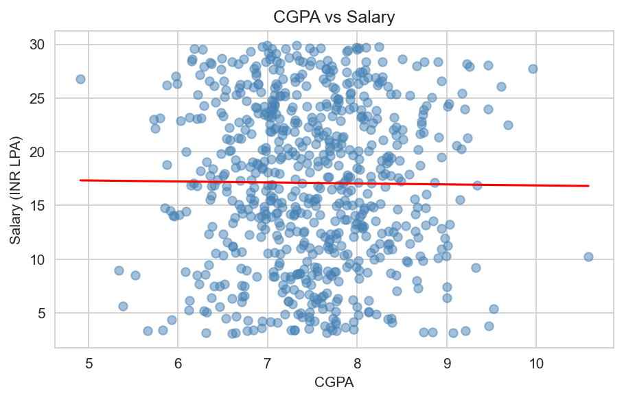

# CGPA, Internships and Placement Analysis

A lot of people say "if your CGPA is good, you'll get placed and get a good salary." This
project actually checks that using a dataset of 1000 students, instead of just assuming it's
true.

## Dataset

`Placement.csv` has 1000 rows with these columns:
- `Student_ID`
- `CGPA`
- `Internships`
- `Placed` (Yes/No)
- `Salary (INR LPA)`

## What I did

1. Checked the data for missing values, duplicates, and anything odd (found that the 310 rows
   with `Salary = 0` are exactly the 310 students who were not placed - so that's not bad data)
2. Cleaned the data and dropped `Student_ID` since it's just a row number
3. Made some charts to explore the data - placement counts, CGPA distribution, CGPA vs
   placement, internships vs placement, correlation between the numeric columns, and a CGPA vs
   Salary scatter plot
4. Trained a classification model (Logistic Regression + Random Forest) to predict `Placed`,
   compared against a simple baseline (just guessing "placed" for everyone)
5. Trained a regression model (Linear Regression + Random Forest) to predict `Salary` for the
   placed students, also compared against a baseline (just guessing the average salary)
6. Wrote down what all of this actually means

## What I found

- Average CGPA is almost the same for placed and not-placed students
- Placement rate doesn't change much with number of internships
- Correlation between CGPA and Salary is close to 0
- The placement model scores about the same as just guessing "placed" for everyone (~69%
  accuracy)
- The salary model's R2 score is close to 0 (even negative for random forest) - it doesn't beat
  just guessing the average salary

So in this dataset, CGPA and internship count alone don't really predict placement or salary.
That doesn't mean CGPA never matters in real life, but with only these two features, there
isn't much signal to work with. Things like skills, aptitude scores, communication, and
interview performance are probably a bigger factor, but this dataset doesn't have that
information.

## Files

- `placement_analysis.ipynb` - the main notebook with all the steps
- `Placement.csv` - raw data
- `Placement_clean.csv` - cleaned data (created by the notebook)
- `assets/` - a few charts saved from the notebook

## Tools used

Python, pandas, numpy, matplotlib, seaborn, scikit-learn, scipy
